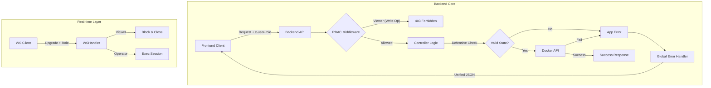

# DevOpsEase - Docker Container Intelligence Platform

A comprehensive full-stack application for intelligent Docker container monitoring, analysis, and failure diagnostics with **Redis-backed caching** for optimal performance.

## 🚀 Quick Start

### Prerequisites

- **Node.js** (v18+)
- **npm** or **yarn**
- **Docker** (for container operations)
- **Redis** (optional, for caching - see Docker Compose below)

### Installation & Setup

#### Option 1: Using Docker Compose (Recommended)

The easiest way to get started with full Redis caching support:

```bash
git clone https://github.com/mamun0193/devopsease.git
cd devopsease

# Start Redis service
docker compose up redis -d

# Start backend
cd server
npm install
npm start

# In a new terminal, start frontend
cd dashboard
npm install
npm run dev
```

#### Option 2: Manual Setup (Without Redis)

The application works without Redis - it will fall back to direct Docker API calls.

```bash
git clone https://github.com/mamun0193/devopsease.git
cd devopsease
```

**Backend Server:**

```bash
cd server
npm install
npm start
```

**Frontend Dashboard:**

```bash
cd dashboard
npm install
npm run dev
```

---


### 🏗️ Architecture & RBAC Flow

The system implements a secure, role-based architecture with centralized error handling and defensive state management.



### Redis-Backed Caching Layer

The backend uses a tiered caching strategy to minimize Docker API calls while maintaining real-time accuracy:

```
┌─────────────────────────────────────────────────────────────────┐
│                        Frontend (React)                          │
├─────────────────────────────────────────────────────────────────┤
│  Stats (2s)  │  Container List (15s)  │  Inspect Data (30s)     │
│  Real-time   │     Cached 15s TTL     │    Cached 45s TTL       │
└──────┬───────┴──────────┬─────────────┴──────────┬──────────────┘
       │                  │                        │
       ▼                  ▼                        ▼
┌─────────────────────────────────────────────────────────────────┐
│                     Backend (Express.js)                         │
├─────────────────────────────────────────────────────────────────┤
│                      Redis Cache Layer                           │
│  • Request deduplication                                         │
│  • Tiered TTLs (state: 15s, config: 45s)                        │
│  • Automatic cache invalidation on actions                      │
│  • Graceful fallback when Redis unavailable                     │
└──────────────────────────────┬──────────────────────────────────┘
                               │
                               ▼
                    ┌─────────────────────┐
                    │     Docker API       │
                    └─────────────────────┘
```

### Data & Caching Strategy

| Data Type                | Backend TTL  | Frontend Interval | Description          |
| ------------------------ | ------------ | ----------------- | -------------------- |
| CPU, Memory, Network     | **No cache** | 2s                | Real-time metrics    |
| Container list           | 15s          | 15s               | All containers       |
| Status, health, restarts | 15s          | 15s               | Container state      |
| Image, ports, labels     | 45s          | 30s               | Static configuration |
| Action history           | Persistent   | 10s               | Redis list storage   |

---

## 📋 Project Structure

```
devopsease/
├── docker-compose.yml         # Redis + Backend services
├── dashboard/                 # React + Vite frontend
│   ├── src/
│   │   ├── components/        # UI components
│   │   ├── hooks/             # Custom React hooks
│   │   │   ├── useContainers.ts       # Data fetching hooks
│   │   │   └── useContainerPolling.ts # Visibility-aware polling
│   │   ├── api/               # API integration
│   │   └── utils/             # Utilities
│   └── package.json
│
├── server/                    # Express.js backend
│   ├── Dockerfile             # Container image
│   ├── src/
│   │   ├── docker/            # Docker client & operations
│   │   ├── redis/             # Redis client & caching
│   │   │   ├── client.js      # Connection management
│   │   │   └── cacheService.js # Cache-aside pattern
│   │   ├── intelligence/      # Failure analysis & classification
│   │   ├── routes/            # API endpoints
│   │   └── services/          # Business logic
│   │       ├── containerCache.service.js  # Tiered caching
│   │       └── actionHistory.service.js   # Redis-backed history
│   └── package.json
│
└── docs/                      # Learning documentation
```

---

## 🔧 Key Features

### 🔐 Authentication Note (Day 30)

> **Note:** For demonstration purposes, this version uses a **mock authentication system**.
>
> - **Roles are simulated** via the `x-user-role` header (default: `operator`).
> - **Viewer Role:** Read-only access to containers and logs. destructive actions are blocked.
> - **Operator Role:** Full control (start, stop, remove, exec).
>
> In a production environment, this would be replaced by a real identity provider (e.g., OAuth2, OIDC).

### Backend

- **Redis Caching**: Tiered cache strategy with automatic invalidation
- **Role-Based Access Control**: Strict `viewer` vs `operator` permission enforcement
- **Defensive Coding**: Pre-action state validation to prevent invalid Docker operations
- **Unified Error Handling**: Standardized error responses and user-friendly messages
- **Request Deduplication**: Prevents duplicate Docker API calls
- **Real-time Monitoring**: Live container stats (CPU, memory, network)
- **Intelligent Analysis**: AI-powered failure classification
- **Container Operations**: Start, stop, restart, remove with action history
- **Graceful Degradation**: Works without Redis (direct Docker API)

### Frontend

- **Visibility-Aware Polling**: Pauses when tab is hidden
- **Smart Polling Intervals**: Differentiated by data freshness needs
- **Automatic Refetch**: Immediate updates after container actions
- **Real-time Stats**: Live resource usage visualization
- **Failure Analysis UI**: Interactive diagnostics view

---

## 🔐 Environment Variables

### Server

| Variable     | Default       | Description           |
| ------------ | ------------- | --------------------- |
| `PORT`       | `4000`        | Server port           |
| `NODE_ENV`   | `development` | Environment mode      |
| `REDIS_HOST` | `localhost`   | Redis server hostname |
| `REDIS_PORT` | `6379`        | Redis server port     |

Create a `.env` file in the `server/` directory:

```env
PORT=4000
NODE_ENV=development
REDIS_HOST=localhost
REDIS_PORT=6379
```

---

## � Docker Compose

Run the full stack with Docker Compose:

```bash
# Start all services
docker compose up -d

# Start only Redis (for local development)
docker compose up redis -d

# View logs
docker compose logs -f

# Stop all services
docker compose down
```

### Services

| Service   | Port | Description                  |
| --------- | ---- | ---------------------------- |
| `redis`   | 6379 | Redis cache with persistence |
| `backend` | 4000 | Express.js API server        |

---

## 📊 Monitoring

### Redis Cache

```bash
# Watch Redis operations
redis-cli MONITOR

# Check cached keys
redis-cli KEYS "container:*"
redis-cli KEYS "devopsease:*"

# View action history
redis-cli LRANGE "devopsease:actions:history" 0 10
```

### Backend Logs

Key log messages to watch:
- `Redis connected` - Cache enabled
- `Cache hit` - Data served from cache
- `Cache miss` - Data fetched from Docker
- `Cache invalidated` - Keys cleared after action

---

## 📚 Learning Roadmap

### Days 1-2 (Current Repository)

- [Day 1: Docker Backend Fundamentals](./docs/DAY_1.md)
- [Day 2: Professional Backend Architecture](./docs/DAY_2.md)

### Days 3-15 (Related Repositories)

**Docker Fundamentals Series:**
- Repository: [docker-fundamentals](https://github.com/mamun0193/docker-fundamentals.git)

**AWS Cloud Deployment Series:**
- Repository: [rexpress-docker-aws](https://github.com/mamun0193/rexpress-docker-aws.git)

### Days 16-25 (Current Repository)

- [Day 16: Failure Taxonomy](./docs/DAY_16.md)
- [Day 17: Failure Detection & Intelligence](./docs/DAY_17.md)
- [Day 18: API Integration & Real-Time Failure Analysis](./docs/DAY_18.md)
- [Day 19: Failure History & Confidence Boosting](./docs/DAY_19.md)
- [Day 20: Observability & Routing Enhancements](./docs/DAY_20.md)
- [Day 21: Advanced Log Parsing & Filtering](./docs/DAY_21.md)
- [Day 22: Frontend LogViewer Component](./docs/DAY_22.md)
- [Day 23: Container Control Backend APIs](./docs/DAY_23.md)
- [Day 24: Container Controls UI (React + Redux)](./docs/DAY_24.md)
- [Day 25: Container Stats & Resource Usage](./docs/DAY_25.md)
- [Day 26: Operation History & Timeline](./docs/DAY_26.md)
- [Day 27: Redis-Backed Caching & Performance Optimization](./docs/DAY_27.md)
- [Day 28: Container Actions & Error Resilience(pause/unpause and create container)](./docs/DAY_28.md)
- [Day 29: Real-Time Container Terminal)](./docs/DAY_29.md)
- [Day 30: Role-Based Access Control](./docs/DAY_30.md)

---

## 📖 Additional Resources

- [Node.js Documentation](https://nodejs.org/docs/)
- [Docker Documentation](https://docs.docker.com/)
- [Redis Documentation](https://redis.io/docs/)
- [React Documentation](https://react.dev/)
- [Express.js Guide](https://expressjs.com/)

---

## 📝 License

This project is part of a learning series. See individual repositories for license information.

---

## 👨‍💻 Author

**Mamun** - [GitHub Profile](https://github.com/mamun0193)

---

**Happy Learning! 🚀**
