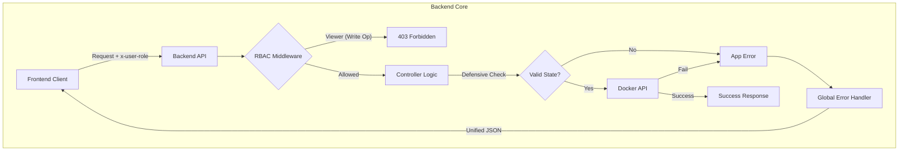

# Day 30: Role-Based Access Control & Production Readiness

## 📝 Overview

Day 30 focuses on transforming DevOpsEase into a production-ready application by implementing **Role-Based Access Control (RBAC)**, robust **Error Handling**, and **Defensive Coding** practices. These additions ensure that the system is secure, stable, and provides a consistent user experience even during failure states.

## 🛡️ Key Features

### 1. Role-Based Access Control (RBAC)

We implemented a strict separation of duties using two primary roles:

- **Viewer (`viewer`)**: Read-only access to container lists, stats, and logs. Cannot perform any destructive actions.
- **Operator (`operator`)**: Full control over all system resources, including starting, stopping, and removing containers.

**Implementation Details:**

- **Backend Middleware**: `requireRole` middleware checks the `x-user-role` header on every protected route.
- **Frontend Context**: `RoleContext` provides global access to the current user's role and exposes `isViewer` / `isOperator` flags.
- **Visual Feedback**: Destructive buttons are disabled for Viewers with a tooltip explaining the restriction. Terminal access is completely blocked with an overlay.

### 2. Unified Error Handling

We standardized how the backend reports errors to ensure the frontend can always display meaningful messages to the user.

**New Error Structure:**

```json
{
  "success": false,
  "error": true,
  "message": "Container 123 not found",
  "code": "RESOURCE_NOT_FOUND"
}
```

- **AppError Class**: A custom error class to handle operational errors with specific status codes.
- **Global Error Handler**: A centralized express middleware that catches all errors and formats them into the standard JSON response.

### 3. Defensive Coding & Cleanup

To prevent "zombie" processes and state inconsistencies:

- **State Validation**: Actions like `start` or `stop` now verify the container's current state before attempting Docker operations.
- **Resource Cleanup**: When a container is stopped or removed, any active WebSocket sessions (logs or exec) for that container are immediately terminated.
- **Graceful Shutdown**: On server exit (`SIGTERM`), all open connections and streams are explicitly closed.

## 🏗️ Architecture: RBAC Flow



## 💻 Tech Stack Additions

- **Middleware**: Custom `rbac.js` and `errorHandler.js`
- **Context API**: React `createContext` for role management
- **Storage**: `localStorage` for persisting user role preference

## 🧪 Verification

### How to Test RBAC

1. **Default Operator Mode**:
    - Open the Dashboard.
    - Try to Start/Stop a container. **Expect**: Success (200 OK).
    - Open Terminal. **Expect**: Connection successful.

2. **Viewer Mode**:
    - Open Developer Tools -> Application -> Local Storage.
    - Set `devopsease_role` to `viewer`.
    - Refresh the page.
    - **Expect**: "Start/Stop" buttons are disabled.
    - **Expect**: Terminal view shows "Access Restricted" lock overlay.
    - **Backend Check**: `curl -H "x-user-role: viewer" -X POST http://localhost:4000/containers/123/stop` should return **403 Forbidden**.

## Lessons Learned

- **Defensive State Checks**: relying on Docker to return an error for invalid state transitions (like stopping a stopped container) is often slower and less descriptive than checking state ourselves first.
- **Frontend/Backend Sync**: Using a shared error code convention allows the frontend to show specific UI elements (like a "Paywall" or "Permission Denied" modal) based on backend logic.
