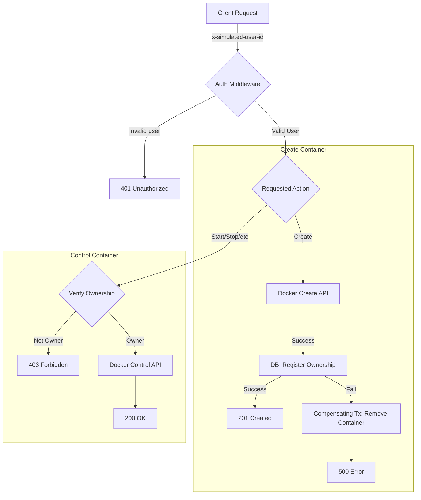

# Day 31: MongoDB Integration & Ownership Registry

## 📝 Overview

Day 31 marks a critical architectural shift for DevOpsEase. We have moved from in-memory, transient storage to a persistent, MongoDB-backed infrastructure. This update introduces the **Ownership Registry**, a core security component that links every Docker container to a specific user, ensuring resource isolation and accountability.

## 🛡️ Key Features

### 1. MongoDB-Backed Persistence

We replaced temporary data structures with MongoDB collections to ensure system state survives server restarts.

-   **Connection Resilience**: The server now features robust connection handling, including retry logic, timeouts, and graceful shutdowns.
-   **Fail-Fast Architecture**: The system refuses to start if the database is unreachable, preventing "zombie" states.
-   **Circuit Breaker**: Runtime database failures trigger a `503 Service Unavailable` response, protecting the system from cascading failures.

### 2. The Ownership Registry

A new dedicated service that enforces strict ownership rules for all container resources.

-   **Atomic Registration**: Containers are registered to a user immediately upon creation.
-   **Compensating Transactions**: If a database write fails after a Docker container is created, the system automatically rolls back (removes) the Docker container to prevent orphaned resources.
-   **Strict Verification**: Every action (Start, Stop, Logs, Exec) now performs a real-time database lookup to verify the requester owns the target container.

### 3. Identity & Security Models

We introduced two core Mongoose models to verify identity and ownership:

-   **User Model**: Stores identity and profile information.
-   **ContainerOwnership Model**: A verifiable link between a `User ID` and a `Container ID`.
    -   *Immutable Design*: Ownership records are never updated, only created or marked as `released` to maintain an audit trail.

## 🏗️ Architecture: Ownership Flow



## 💻 Tech Stack Additions

-   **Database**: MongoDB (via Mongoose ODM)
-   **Security**: Custom `auth.middleware.js` and `validateDatabase.js`
-   **Service**: `ownership.service.js` for centralized logic

## 🧪 Verification

### How to Test Ownership
We have simulated authentication for development using headers.

1.  **Seed the Database**:
    ```bash
    cd server
    npm run seed
    # Copy the User ID from the output (e.g., 698a...)
    ```
2.  **Make Authenticated Requests**:
    Add the header `x-simulated-user-id: <YOUR_USER_ID>` to your requests.
    
    -   **Create**: `POST /containers` (Registers ownership)
    -   **List**: `GET /containers` (Shows only your containers)
    -   **Control**: `POST /containers/:id/stop` (Allowed only if you own it)

3.  **Test Security**:
    -   Try requests **without** the header -> `401 Unauthorized`
    -   Try accessing a container with a **different** User ID -> `403 Forbidden`

## Lessons Learned

-**Distributed consistency is hard**: Syncing state between Docker (the runtime source of truth) and MongoDB (the metadata source of truth) requires careful error handling and compensating transactions.
-   **Short IDs vs Long IDs**: Docker and MongoDB use different ID formats. Normalizing them is crucial for consistent lookups.

## 🚀 What's Next: Day 32 — OAuth + User Lifecycle

Day 32 turns **ownership into identity**. We will move from developer-assumed identity to real-user authentication.

-   **OAuth Integration**: GitHub & Google login (no custom auth logic).
-   **User Lifecycle**: Auto-creating or linking users upon successful login.
-   **JWT Authentcation**: Issuing short-lived tokens for session management.
-   **Real Auth Middleware**: Replacing the `x-simulated-user-id` header with strict JWT validation.
-   **Session Safety**: Ensuring logouts kill active sessions and prevent zombie processes.

*Goal: Every request has a real authenticated user, and ownership is tied to a verified identity.*
it