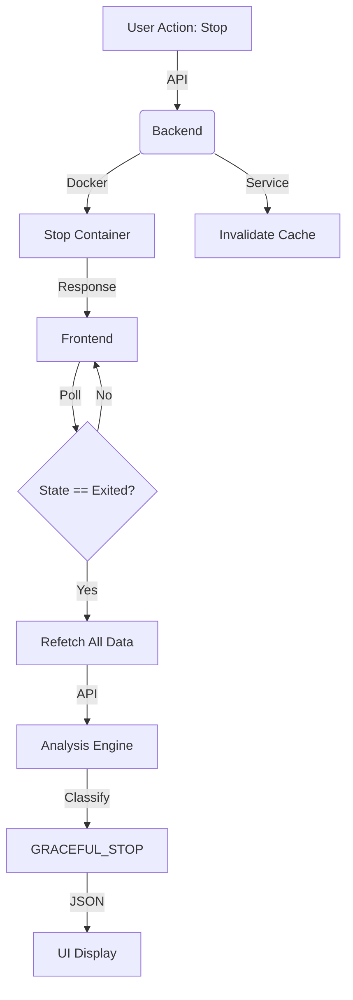

# Day 41 — Instant Failure Intelligence

> **Focus:** Real-time Analysis & UX  
> **Core Principle:** "Intelligence at the speed of thought."

---

## 🎯 Goal

Transition DevOpsEase from a **reactive** monitoring tool to a **proactive** intelligence system. The goal was to provide **instant, accurate, and human-readable analysis** of container states immediately after user actions, eliminating "Unknown" states and manual refresh delays.

---

## 🛠️ Key Technical Changes

### 1. Backend: Enhanced Intelligence Engine (`src/intelligence/`)

- **New Classifications:** Added explicit support for non-failure states in `classifier.js`:
    - `HEALTHY`: Container running normally with no issues.
    - `PENDING`: Container is starting up or restarting.
    - `PAUSED`: Container is effectively paused.
    - `GRACEFUL_STOP`: Distinguished clean exits (code 0/137/143) from crashes.
- **Smart Detection:** Updated `detectGracefulStop` to ignore historical restart counts if the current stop was intentional and clean.
- **Instant Cache Invalidation:** Implemented `invalidateAnalysisCache` service to clear stale analysis data immediately upon container state changes (`start`, `stop`, `pause`, `unpause`).

### 2. Frontend: Zero-Latency Data Layer (`src/hooks/useContainers.ts`)

- **Immediate Refetching:** Replaced passive `invalidateQueries` (which waits for the next window focus or polling cycle) with active `refetchQueries`.
- **Atomic Updates:** Container actions now trigger a **blocking refetch** of all related data (`inspect`, `stats`, `logs`, `analysis`) ensuring the UI never displays stale "Running" state after a "Stop" command.
- **Poll-Until-State:** Implemented intelligent polling in `ContainerControls` to wait for Docker to confirm state transitions before refreshing the UI.

### 3. UI: Modernized Intelligence Card (`src/components/FailureAnalysis.tsx`)

- **Preserved Design:** Restored the beloved classic "Health Status" card layout.
- **New Brain:** Completely refactored the internal logic to consume the **Failure Intelligence API v2**.
- **Rich Insights:** Now displays:
    - **Confidence Score:** Visual bar showing how certain the system is (Low/Medium/High).
    - **Evidence:** Technical signals used for the diagnosis (e.g., `exit_code:137`, `log_pattern:OOM`).
    - **Suggested Actions:** Actionable steps for the user.
- **Dynamic States:** Visual indicators for `HEALTHY`, `PAUSED`, `PENDING` states with appropriate colors and icons (Emerald, Slate, Blue).

---

## 🏗️ Architecture

### Intelligence Pipeline

---

## 🧪 Verification

| Scenario            | Result                                                           |
| :------------------ | :--------------------------------------------------------------- |
| **Start Container** | ✅ UI shows "PENDING" then immediately "HEALTHY"                  |
| **Stop Container**  | ✅ UI waits for exit, then shows "GRACEFUL STOP" (Code 0/143)     |
| **Pause Container** | ✅ UI instantly switches to "PAUSED" state (Slate color)          |
| **Crash (dev)**     | ✅ UI detects "CRASH_LOOP" or "CONFIG_ERROR" with High confidence |
| **Manual Refresh**  | ✅ Eliminated. Updates are push-like in feel.                     |

---

